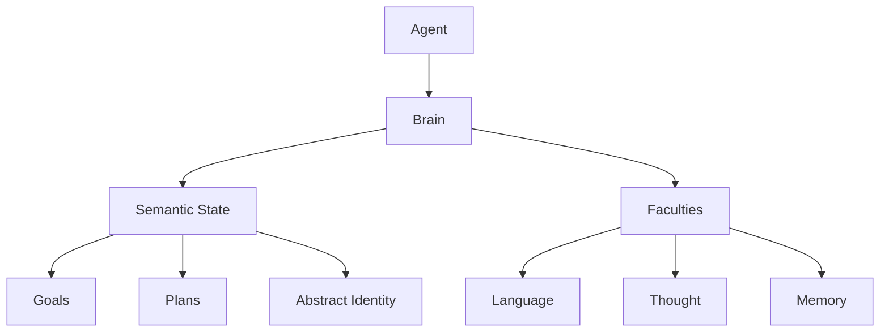

# Screenwriter Architecture Documentation

## 1. Overview
Screenwriter is an autonomous agentic framework designed to emulate the creative process of a screenwriter. It is not just a text completion tool; it represents a recursive, stateful entity that "thinks" before it writes.

## 2. Core Concepts

### 2.1 The Bio-Inspired Model
The architecture mimics a biological cognitive system:
- **Agent**: The physical embodiment / identity.
- **Brain**: The central controller managing state and coordination.
- **Faculties**: Specialized lobes for specific functions (Language, Thought, Memory).
- **Semantics**: The "mind" or software running on the hardware.



### 2.2 Thinking Shapes
The agent's cognition is malleable. We define its mental state using "Thinking Shapes," which consist of:
1.  **Speed (Model)**: Which GenAI model to use (Fast vs. Thoughtful).
2.  **Clarity (Depth)**: How much internal reasoning (Chain of Thought) to apply.

| Speed | Function | Model |
| :--- | :--- | :--- |
| `FAST` | Validations, simple loops | `gemini-2.5-pro` |
| `STANDARD` | JSON extraction, drafting | `gemini-3-flash-preview` |
| `THOUGHTFUL`| Creative writing, deep analysis | `gemini-3-pro-preview` |

## 3. The Faculties

### 3.1 Language Faculty (`src/siena-agent/brain/language`)
**Role:** The Broca's Area. It handles the raw interface with the Google GenAI API.
**Key Features:**
- **Automatic Retry:** Implements exponential backoff for 503/429 errors.
- **Context Injection:** Automatically injects system instructions and thinking configs.

### 3.2 Thought Faculty (`src/siena-agent/brain/thought`)
**Role:** The Prefrontal Cortex. It manages higher-order cognitive tasks.
**Key Capabilities:**
- **Recursive Narrative Flow:** Uses a "seed" text to grow a story iteratively.
- **Hypothesis Formulation:** Analyzes narratives to extract scientific or philosophical hypotheses in structured JSON.

### 3.3 Memory Faculty (`src/siena-agent/brain/memory`)
**Role:** The Hippocampus. It handles persistence.
**Current State:**
- Stores `Narratives`, `Hypotheses`, and `Topics` as JSON files on disk.
- *Planned:* Vector database integration for semantic retrieval.

## 4. Semantic State
The "Memory" of the agent is a structured graph of:
- **Abstract State:** What/Where/Why/How (The current context).
- **Meta-Goal:** The user-defined immutable objective.
- **Goals & Plans:** Derived executable steps.

## 5. Usage Patterns

### The "Pulse"
The agent operates in discrete cycles called "Pulses".
*Note: This feature is currently under active development.*

```typescript
// Example of manually driving the agent
const narrative = await agent.brain.faculties().thought.flow_narrative(seed_data);
await agent.brain.faculties().memory.saveNarrative(narrative);
```
