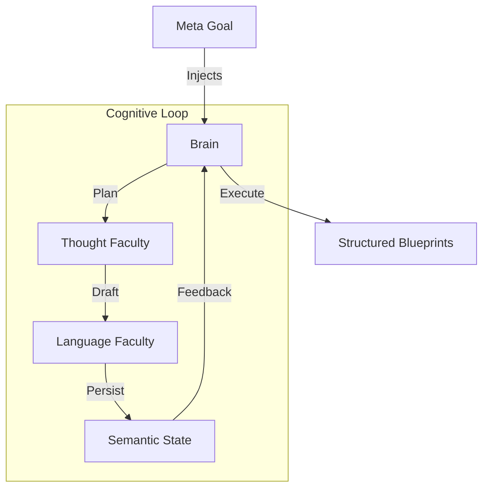

# Experimental Research: Recursive Agentic Architectures with Contextful RAG for Generative Media

> **Status**: Active Research
> **Domain**: Cognitive AI, Systems Architecture, Generative Media
> **Stack**: TypeScript, Google GenAI (Gemini), LanceDB (Vector DB)

## Abstract

This repository serves as an open research lab exploring my take on **Recursive Agentic Architectures**. The primary subject of study is **Siena**, a bio-inspired autonomous agent designed to solve the challenge of coherent long-form language generation. The goal behind the research is to find the most effective ways to implement recursive agentic architectures, cheifly, how to imlement its memory and handle its embeddings. To acheive this end, the **Screenwriter** project will be used as a testbed for the research. 

**Siena** is my first prototype of a recursive agentic architecture which uses a seperate cloud hosted large language model to generate content, and a local vector database to store the embeddings of the generated content. 

I've set down the foundations for **Siena** and it has succesfully implemented the core Google GenAI generation and it's state has been defined.

**Screenwriter** is designed to autonomously research, conceptualize, and write screenplays. It leverages **Siena** to perform high-level cognitive tasks, managing its own state, goals, and creative process. It uses an operator defined *Meta Goal* to guide its goal creation and planning process. It will be eventually implemented with a remotion templater to generate video essay style videos with the screenplay scripts generated by the agent.

## Core Research Questions

1.  **Can we mitigate long-context drift via recursive goal decomposition?**
    *   *Hypothesis 1*: By breaking a Meta-Goal into atomic, verifiable sub-goals, an agent can maintain coherence indefinitely.
    *   *Hypothesis 2*: By storing the context of the agent in many different fidilities, and in both embedding and semantic forms, an agent can maintain coherence indefinitely.
2.  **How can "Thinking Speed" be viably implemented?**
    *   *Hypothesis*: Dynamically swapping underlying models (Flash vs. Pro) based on the semantic complexity of the current task node could prove fruitful. Letting the dynamic swapping be based on some mathamatical lagging function that gauges a pressure of complexity of a task.
3.  **What can be done to enforce creativity programmatically?**
    *   *Question*: Can we enforce creativity programmatically?
4.  **What is the best way to extract and store embeddings for a recursive agentic architecture?**
    *   *Question*: How can we best extract and store embeddings for a recursive agentic architecture?
## Current System Architecture

The system mimics a biological cognitive loop:

### Key Components

Please see [DOCS.md](DOCS.md) for a detailed architectural deepdive.

*   **The Brain (Controller)**: Currently it is not implemented fully. A centralized state machine that manages the "Pulse" of the agent. It dictates *when* to think deeply (Reasoning Models) and *when* to execute quickly (Flash Models).
*   **Semantic State (Memory)**: Tracks the agent's state described semantically.
*   **Faculties (Modules)**: Specialized functional units.
    *   *Language*: Interface to raw LLM inference.
    *   *Thought*: Higher-order logic, hypothesis generation, and narrative recursion.
    *   *Memory*: Currently it is not implemented fully. A structured graph database (JSON/Vector) representing the agent's memory. The JSON is stored raw while the vector is stored in LanceDB which isn't implemented.

## Current Experiments

### 1. The Recursive Narrative Engine
An implementation of a recursive authoring loop. The agent takes a "seed" (a synopsis) and iteratively expands it.
*   **Mechanism**: The output of Iteration N becomes the context for Iteration N+1.
*   **Control**: A separate "Reviewer" personality periodically interrupts the loop to check for thematic consistency against the original Meta-Goal.

### 2. Multi-Model "Thinking Shapes"
We are testing the efficacy of "Thinking Shapes"—state configurations that define the cognitive load of a request.
*   **`THOUGHTFUL`**: Uses `gemini-3-pro-preview` for deep reasoning and complex JSON extraction.
*   **`STANDARD`**: Uses `gemini-3-flash-preview` for high-throughput drafting.
*   **`FAST`**: Uses `gemini-2.5-flash` for rapid validation cycles.

## Problems and Limitations

As this is an active research prototype, several significant architectural and implementation challenges remain:

1.  **Memory Volatility & Brittle State**
    *   *Issue*: Currently, the agent relies on a file-system based JSON store for its "Semantic State". This is slow, hard to query efficiently, and prone to corruption if the process is interrupted.
    *   *Impact*: The agent cannot effectively "search" its own past memories without loading entire files into the context window, limiting the effective long-term memory horizon.
    *   *Planned Fix*: Migration to a local Vector Database (LanceDB) to allow for semantic querying of memory fragments.

2.  **Recursive Context Drift**
    *   *Issue*: While recursive loops allow for infinite generation length, small deviations in "tone" or "fact" in early iterations compound over time.
    *   *Impact*: By iteration 100, the narrative may completely diverge from the Meta-Goal if the "Reviewer" loop isn't calibrated perfectly. The "Game of Telephone" effect is real.
    *   *Mitigation*: We are tuning the "Reviewer" strictness, but an over-zealous reviewer leads to creative stagnation (loops where the agent refuses to write anything new).

3.  **Model Determinism & Reasoning Instability**
    *   *Issue*: The `pro-preview` "Thinking" models are powerful but highly volatile. They frequently hang on complex JSON schema enforcement or hallucinate schema structures despite strict prompting.
    *   *Impact*: The `formulate_hypothesis` loop often requires retries (automated in the code), slowing down the generation pipeline significantly.
    *   *Trade-off*: We trade speed and reliability for the "spark" of creative reasoning, but for a production system, this unpredictability is a major blocker.

4.  **Cost vs. Quality in Recursion**
    *   *Issue*: Recursive architectures multiply token leverage exponentially. A single "Goal" might spawn 10 sub-plans, each with 5 iterations.
    *   *Impact*: Even with cheap models like `flash`, the sheer volume of tokens generated for a single minute of video script can be immense.
    *   *Observation*: "Thinking" is expensive. We need to find the minimal viable thought required for coherence.

5.  **The "Blank Page" Hallucination**
    *   *Issue*: When given too much freedom (an abstract Meta-Goal), the agent tends to default to generic tropes.
    *   *Impact*: Without a rich "Research Folder" (Grounding Data), the agent's output is structurally sound but creatively shallow.
    *   *Requirement*: The system currently demands high-quality input data (seeds) to function effectively; it is not yet a true "Zero-Shot" creator.

## Roadmap & Speculations

*   **Vector-Augmented Short-Term Memory**: Implementing a lightweight vector search to allow the agent to "recall" specific narrative threads without reloading the entire context window.
*   **Programmatic Media Generation**: Connecting the structured output (Scripts/Storyboards) directly to rendering engines like Remotion to create an end-to-end "prmpt-to-video" pipeline.
*   **Self-Optimization**: Exploring if the agent can self-modify its own system instructions based on performance feedback.

## TODO
We have to do some general architectural changes simplyfing the type differences betweeen the IAbstractSemanticData and the IReviewable interfaces. The goal is to integrate the datatypes of the program to effeciently map our LLM responses so we can give the agent the ability to think. Because the agent will have to do a lot of different tasks we will have to prompt the AI in many different ways. 

The general conclusion I've arrived at is that due to the cheap costs of the gemini-flash we can use it a lot. I don't mind if we generate 10 million tokens with it over the course of a day, it'll still be cheaper than a coffee. So it makes a lot of sense then use the flash-lite model with many different worker modules (more CPU core usage) and let it make the brunt of the agent's latent thought. 

When playing around in the google ai studio I've discovered that by setting the system instructions to force the agent to behave abstractly you can get it to replicate the mental process.

For example we can let the agent think they are the abstract concept of coherence or understanding and then they will take a random string of texts and bring out a coherent narrative.

For finding goals, or making claims, hypothesis, and topics, because they are opinionated, we must always due the problems with the AI taking up the role of a human. Otherwise they can never select the accurate goals.

We can use the flash-lite model to generate thousands of goals rated with the lite models every 100 goals and with the pro model every 400 goals. The numbers can be tuned at a later date.

The flash-lite model can also generate the micro variations in system instructions or persona's that can drive the metal state of the agent. The agent will always have a detailed description of their past, and their current and will use it to set up their own goals.

We must then create a programmatic interface the LLM can use to actually execute its goals. For example, if one of its goals is to take some media and process it there should be a way for that to actually happen. Likewise, if the AI wants to go on to generate something, there should be a way to get it done. So we can get the goals, plans, or anything else because they are perdictable and can be extracted easily. All we need to do is program the loop. We can program a specific pattern of actions for creating goals, executing on it, and between each we are putting loops in for forming and testing hypothesises and organizing with topics. 

We should find a way to manage the agent context, and its memory context, grabbing the historical DB memory to generate the most relevant semantic description of its memory for the SemanticState. 

The pipeline from Meta Goal into finished goal is explained in an example:

( OPERATOR DEFINED META GOAL )
Metagoal: "I want you to create the script for my video essay on the Queen's Gambit. I want to focus on the psychological allegory aspect."

The ai will then process that meta goal and create a set of *"AXIOMS"* which are injected into every context of language generation, along with the meta goal of course.

The ai then checks the media folders and in this case the OPERATOR has chosen for only the @resarch/final folder to be used. The ai will then parse all the data to create a semantic map of it. It will link diverse types of data, but always notes what it is so the AI can understand it (will come in useful when trying to force evidence for claims). A single large PDF or text essay can be parsed into thousands of nodes, but it's fine because the flash-lite model is so cheap. 

The nodes must be modular in the sense that they are their ideas are self-contained and can be used in any order. These nodes are what we make embeddings on, and if the embeddings are tiny atomic pieces we can modularly search for the most relevant meaning while also storing the orignal text and its exact context and not needing to load it all for the model to understand. This is the key to making the agent's memory efficient and effective.

It then runs a loop of generating abstract goals (what, where, why, how) and then concrete goals (specific actions to take) expressed as string. Program extracts it and uses the same models to expand on the goals, and we do this recursively for at least a couple passes. For now we wil let it happen N number of times which is static, but I'm sensing that there is a way to set up for optimization. I mean there was this nagging itch that told me I will eventually have to implement an optimization function for all the semantic data, but I'm not sure if it's needed yet.

The refined goals are then used to generate a plan, which is a list of steps to take to achieve the goals. The plan is then executed by the agent, and the results are used to update the agent's memory.

With each recursive path we have a review checking cycle that fits the response of the plan to the actual capabilities the model can execute on, therefore modifying the next recursive path to be more accurate and efficient. We always assume that the mind operates on the most efficient mode until needed. This means that if not needed, the model will be in extreme fast thought without thinking. But can upgrade it's own thinking whenever needed, which is decided by the model itself. If the model is stuck producing bad plans or goals, there will be some pressure built over time that causes the thinking to flip.

We can let the agent keep track of its own pressure and thinking mode. It would have to track the quality of all of its outputs compared against the goals it was given, so it can only track the quality of outputs that are trying to achieve some goal (don't track the quality of text genearated like in the coherent narrative example, that's just a side effect of the process but a welcomed one).

Some of the review functions need to be high quality thinking all the time so we can accurately decide but otherwise we will use base settings. 

The end result is an agent which tries to achieve a meta goal, under the framework that is restricted by the program, and creates thousands of goals, and plans which are filtered and refined, with the best ones chosen and executed on. Creating the script that we can use will be a different process entirely. 

For now I want to focus the agent's abiity to produce coherent text, that numbers into the tens of thousands of words. To hold that in it's memory and working space so that it can create a unique synthesis of ideas.

### Memory Class

**TODO**: Implement vector database and solidfy definitions regarding embeddings and string data. We will store both. The vector embeddings will be used to search for data to load effectivly and cheaply. So we will hold a vector embeddings of the tags or other crucial identifying data and store that in the DB to index and load. We can also implement a psuedo "short term" memory which just uses google's GenAI embedding methods for search.

---
*Documentation created with the help of AI*

---
*This repository is a snapshot of ongoing research. Architecture and interfaces are subject to rapid iteration.*
